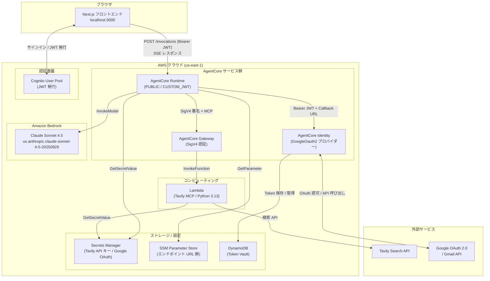

# アーキテクチャ概要

**最終更新**: 2026-04-29  
**対象ブランチ**: main

---

## システム全体構成図

---

## 技術スタック

| レイヤー | 技術 | バージョン |
|---|---|---|
| フロントエンド | Next.js / React / TypeScript | 16 / 19 |
| バックエンド | Python / bedrock-agentcore / Strands Agents | 3.14 |
| LLM | Amazon Bedrock (Claude Sonnet 4.5) | — |
| インフラ | AWS CDK TypeScript | v2 |
| パッケージ管理 | uv (Python) / npm (Node.js) | — |

---

## コンポーネント一覧

| コンポーネント | 実装場所 | 役割 |
|---|---|---|
| フロントエンド | `frontend/src/app/page.tsx` | チャット UI・SSE 受信・OAuth ポップアップ |
| AgentCore Runtime | `agentcore/src/main.py` | エントリポイント・セッション管理・/oauth-complete |
| Strands Agent | `agentcore/src/agents/agent.py` | LLM 呼び出し・ツール登録 |
| スキルシステム | `agentcore/src/skill/` | L1/L2/L3 段階的開示 |
| Gateway MCP クライアント | `agentcore/src/agent/gateway/mcp_client.py` | SigV4 署名で Gateway を呼び出す |
| MCP Runtime クライアント | `agentcore/src/agent/mcp/mcp_runtime_client.py` | JWT + Callback URL で Identity を呼び出す |
| Elicitation Bridge | `agentcore/src/agent/mcp/elicitation_bridge.py` | OAuth URL を SSE に注入 |
| Gateway CDK | `infra/gateway/` | Tavily Lambda + AgentCore Gateway |
| Runtime CDK | `infra/runtime/` | AgentCore Runtime デプロイ |
| Identity CDK | `infra/identity/` | Cognito + AgentCore Identity + DynamoDB |

---

## ローカル開発 vs クラウドの対応

| 項目 | ローカル開発 | クラウド |
|---|---|---|
| Runtime | `npx agentcore dev`（localhost:8080） | AWS AgentCore Runtime（PUBLIC） |
| 認証 | なし（Bearer JWT 不要） | Cognito JWT + CUSTOM_JWT 認証 |
| OAuth（Gmail） | モック（`in_memory` モード） | AgentCore Identity + DynamoDB |
| フロントエンド接続先 | `.env.local`（localhost:8080） | `.env.production`（SSM の URL） |

---

## 変更履歴

| 日付 | 内容 |
|---|---|
| 2026-04-29 | 初版作成 |
