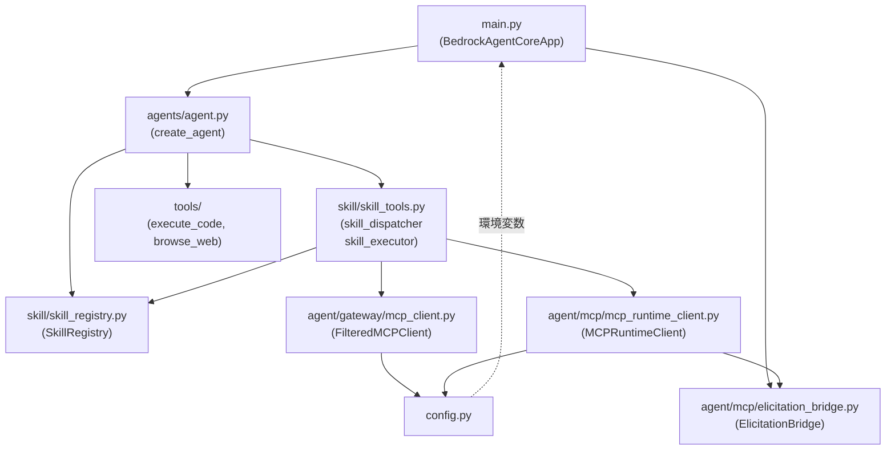
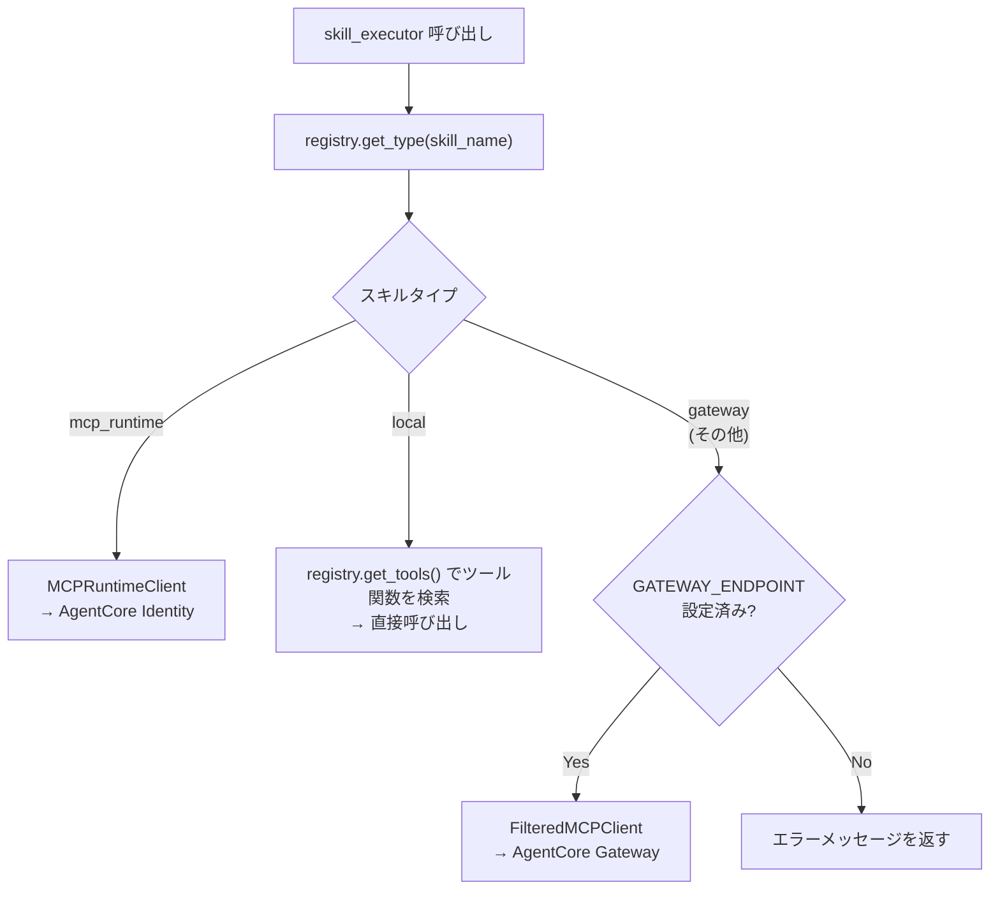

# バックエンド詳細設計

**最終更新**: 2026-04-29  
**対象ディレクトリ**: `agentcore/src/`  
**関連ドキュメント**: [`architecture.md`](architecture.md)

---

## ファイル構成と役割

```
agentcore/src/
├── main.py                        # エントリポイント・ルーティング
├── config.py                      # 環境変数・定数の一元管理
├── agents/
│   └── agent.py                   # Strands Agent の生成ファクトリ
├── agent/
│   ├── gateway/
│   │   └── mcp_client.py          # Gateway（SigV4）呼び出しクライアント
│   └── mcp/
│       ├── elicitation_bridge.py  # OAuth URL を SSE に注入するブリッジ
│       └── mcp_runtime_client.py  # AgentCore Identity 呼び出しクライアント
├── skill/
│   ├── skill_registry.py          # SKILL.md スキャン・管理
│   ├── skill_tools.py             # skill_dispatcher / skill_executor ツール定義
│   └── decorators.py              # @skill デコレータ
└── tools/
    ├── code_interpreter.py        # execute_code（ビルトインツールラッパー）
    └── browser.py                 # browse_web（ビルトインツールラッパー）
```

---

## モジュール依存関係



---

## 主要ファイル詳細

### `main.py` — エントリポイント

| 要素 | 内容 |
|---|---|
| フレームワーク | `BedrockAgentCoreApp`（Starlette ベース） |
| ミドルウェア | `CORSMiddleware`（`localhost:3000` を許可） |
| セッション管理 | `sessions: dict`（session_id → Agent）・`_session_bridges: dict`（session_id → ElicitationBridge）|
| エントリポイント | `@app.entrypoint async def invoke(payload, context)` → async generator で SSE 配信 |
| 追加ルート | `GET /oauth-complete` → `_oauth_complete_handler` |

**invoke の処理フロー**:
1. `payload` から `prompt` と `session_id` を取得
2. セッション対応の Agent を取得（なければ生成）
3. `ElicitationBridge` と `asyncio.Queue` を作成し、コンテキスト変数にセット
4. `pump_agent` タスクで Agent のストリームをキューに転送
5. キューからアイテムを取り出して `yield`（SSE 配信）

---

### `agents/agent.py` — Agent ファクトリ

```python
def create_agent() -> Agent:
    return Agent(
        model=BedrockModel(model_id="us.anthropic.claude-sonnet-4-5-20250929-v1:0"),
        tools=[skill_dispatcher, skill_executor, execute_code, browse_web],
    )
```

- `registry.bind_tools([execute_code, browse_web])` で `@skill` デコレータで紐付けたツールをレジストリに登録する
- Agent のツールは `skill_dispatcher / skill_executor`（スキル経由）と `execute_code / browse_web`（直接呼び出し）の 4 つ

---

### `skill/skill_registry.py` — SkillRegistry

`agentcore/skills/` 配下の `SKILL.md` をすべてスキャンし、スキル情報を管理するシングルトン。

| メソッド | 引数 | 戻り値 | 用途 |
|---|---|---|---|
| `get_catalog()` | なし | `dict[name, description]` | L1 カタログ（システムプロンプト用） |
| `load_instructions(skill_name)` | スキル名 | `str`（SKILL.md 本文） | L2 使い方説明 |
| `get_tools(skill_name)` | スキル名 | `list[Callable]` | L3 ツール関数リスト |
| `get_type(skill_name)` | スキル名 | `"local" / "gateway" / "mcp_runtime"` | 実行経路の判定 |
| `get_scopes(skill_name)` | スキル名 | `list[str]` | OAuth スコープリスト |
| `bind_tools(tools)` | ツール関数リスト | なし | `@skill` デコレータ紐付けの実行 |

**SKILL.md のパース**: YAML frontmatter（`---` で囲まれた部分）から `name / description / type / scopes` を読み込み、残りを `instructions`（本文）として保存。

---

### `skill/skill_tools.py` — skill_dispatcher / skill_executor

**skill_dispatcher（L2）**

```
入力: skill_name（空文字の場合はカタログを返す）
出力: { "instructions": "...", "available_tools": [...] }
```

- `skill_name` が空文字 → `registry.get_catalog()` を返す（L1 カタログ取得）
- それ以外 → `registry.load_instructions()` + `registry.get_tools()` を返す（L2 取得）

**skill_executor（L3）**

```
入力: skill_name, tool_name, tool_input（JSON 文字列）
出力: ツール実行結果
```

実行経路の判定ロジック:



---

### `agent/gateway/mcp_client.py` — FilteredMCPClient

AgentCore Gateway を MCP（Model Context Protocol）経由で呼び出すクライアント。  
AWS SigV4 で署名したリクエストを送信する。

- ツール名の形式: `{skill_name}___{tool_name}`（例: `tavily-search___tavily_search`）
- 認証: `boto3` の `bedrock-agentcore` クライアント経由

---

### `agent/mcp/mcp_runtime_client.py` — MCPRuntimeClient

AgentCore Identity を呼び出すクライアント。OAuth トークンの取得・キャッシュを AgentCore Identity に委譲する。

リクエストヘッダー:
- `Authorization: Bearer {COGNITO_JWT}`
- `MCP-OAuth2-Callback-URL: {MCP_OAUTH2_CALLBACK_URL}`

---

### `agent/mcp/elicitation_bridge.py` — ElicitationBridge

OAuth 同意フローを SSE ストリームに橋渡しするコンポーネント。

| メソッド | 説明 |
|---|---|
| `handle_elicitation(oauth_url)` | OAuth URL を Event Queue に投入。ユーザー承認を非同期で待機 |
| `emit_oauth_complete()` | 承認完了イベントを Event Queue に投入 |

- `asyncio.Queue` を介して `invoke` ジェネレータと通信する（スレッドセーフ）
- `ELICITATION_MODE=in_memory`（ローカル）では即座に完了扱い（モック）
- `ELICITATION_MODE=dynamodb`（本番）では DynamoDB に待機状態を保存

---

### `config.py` — 設定一元管理

| 変数名 | デフォルト値 | 説明 |
|---|---|---|
| `REGION` | `"us-east-1"` | AWS リージョン |
| `GATEWAY_ENDPOINT` | `""` | AgentCore Gateway の URL |
| `COGNITO_JWT` | `""` | Cognito ID Token（本番時はフロントエンドが動的に設定） |
| `MCP_OAUTH2_CALLBACK_URL` | `"http://localhost:8080/oauth-complete"` | OAuth コールバック URL |
| `ELICITATION_MODE` | `"in_memory"` | `in_memory`（ローカル）or `dynamodb`（本番） |
| `DYNAMODB_TOKEN_VAULT_TABLE` | `""` | Token Vault テーブル名 |

---

## スキル定義（SKILL.md）

現在登録されているスキル:

| スキル名 | タイプ | 説明 |
|---|---|---|
| `tavily-search` | `gateway` | Tavily Search / Extract（Web 検索） |
| `gmail` | `mcp_runtime` | Gmail 読み取り（OAuth 認証必要） |

---

## 変更履歴

| 日付 | 内容 |
|---|---|
| 2026-04-29 | 初版作成 |
