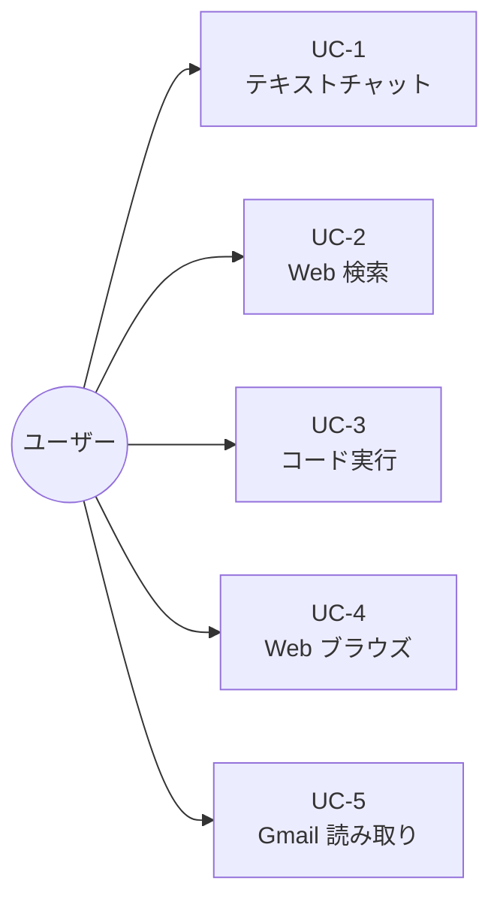
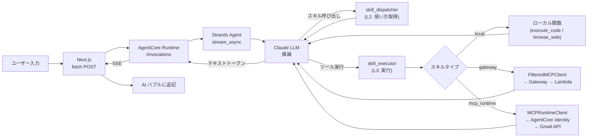

# 基本設計

**最終更新**: 2026-04-29  
**関連ドキュメント**: [`architecture.md`](architecture.md)

---

## プロジェクト目的

Strands Agents と Amazon Bedrock AgentCore を使ったミニマムなチャットアプリ。  
参照リポジトリ（`aws-samples/sample-strands-agent-with-agentcore`）を最小構成で再現し、  
AgentCore の仕組みを学習することが目的。

---

## ユースケース一覧

| UC | ユースケース | 使用コンポーネント | 認証 |
|---|---|---|---|
| UC-1 | テキストチャット | Strands Agent + Claude（Bedrock） | 不要（ローカル）/ Cognito JWT（本番） |
| UC-2 | Web 検索 | Tavily スキル → Gateway → Lambda → Tavily API | SigV4（AWS IAM） |
| UC-3 | コード実行 | AgentCore Code Interpreter（ビルトインツール） | AWS SDK |
| UC-4 | Web ブラウズ | AgentCore Browser（ビルトインツール） | AWS SDK |
| UC-5 | Gmail 読み取り | Gmail スキル → AgentCore Identity → Gmail API | Cognito JWT + Google OAuth 3LO |

---

## データフロー概要

---

## 主要な設計判断

### D-1: フレームワークに BedrockAgentCoreApp を使用

**判断**: FastAPI ではなく `BedrockAgentCoreApp`（Starlette ベース）を採用。

**理由**: AgentCore Runtime は `BedrockAgentCoreApp` に対応した専用ランタイムであり、  
`@app.entrypoint` に async generator を登録するだけで SSE ストリーミングが自動的に有効になる。  
FastAPI を使うと AgentCore の管理機能（ヘルスチェック・セッションヘッダー・ポート管理）を  
自前で実装する必要が生じる。

---

### D-2: ストリーミングプロトコルに SSE（直接 fetch）を使用

**判断**: 参照リポジトリの AG-UI プロトコルではなく、シンプルな SSE + `fetch` を採用。

**理由**: AG-UI は高機能（中断・再試行・イベント型管理）だが、学習目的には複雑すぎる。  
SSE を直接 `ReadableStream` で処理することで、ストリーミングの仕組み自体を理解しやすくなる。

---

### D-3: セッション管理はインメモリ dict

**判断**: AgentCore Memory（永続化）ではなく、Python dict でセッションを管理。

**理由**: 学習目的のため永続化は不要。シンプルな `session_id → Agent` のマッピングで  
複数会話の並行処理を実現できる。サーバー再起動で会話履歴はリセットされる（許容範囲）。

---

### D-4: スキルシステムの L1/L2/L3 段階的開示

**判断**: 参照リポジトリと同様に 3 段階のプロンプト最適化を採用。

**理由**: スキルをすべてのツール定義としてシステムプロンプトに含めると、スキルが増えるにつれて  
トークンコストが爆発的に増大する。L1（カタログ）→ L2（使い方）→ L3（実行）の段階的開示により、  
スキル数に依らずプロンプトサイズを一定に保てる。

---

### D-5: インフラはすべて CDK で管理、手動操作禁止

**判断**: AWS Console / CLI の手動操作を排除し、すべて CDK で再現可能な状態を維持。

**理由**: 手動操作は IaC の外に状態が漏れ、再現性を失う。  
ただし Google Cloud Console での OAuth クライアント ID 設定のみ AWS 外部のため手動操作が避けられない。

---

### D-6: クロススタック情報共有に SSM Parameter Store を使用

**判断**: CDK の Cross-Stack Reference ではなく SSM を採用。

**理由**: CDK Cross-Stack Reference は同一 CDK App 内でないと機能しない。  
本プロジェクトは `gateway/`・`runtime/`・`identity/` が独立した CDK プロジェクトのため、  
SSM Parameter Store を共有バスとして使うことで疎結合を維持できる。

---

## 変更履歴

| 日付 | 内容 |
|---|---|
| 2026-04-29 | 初版作成 |
