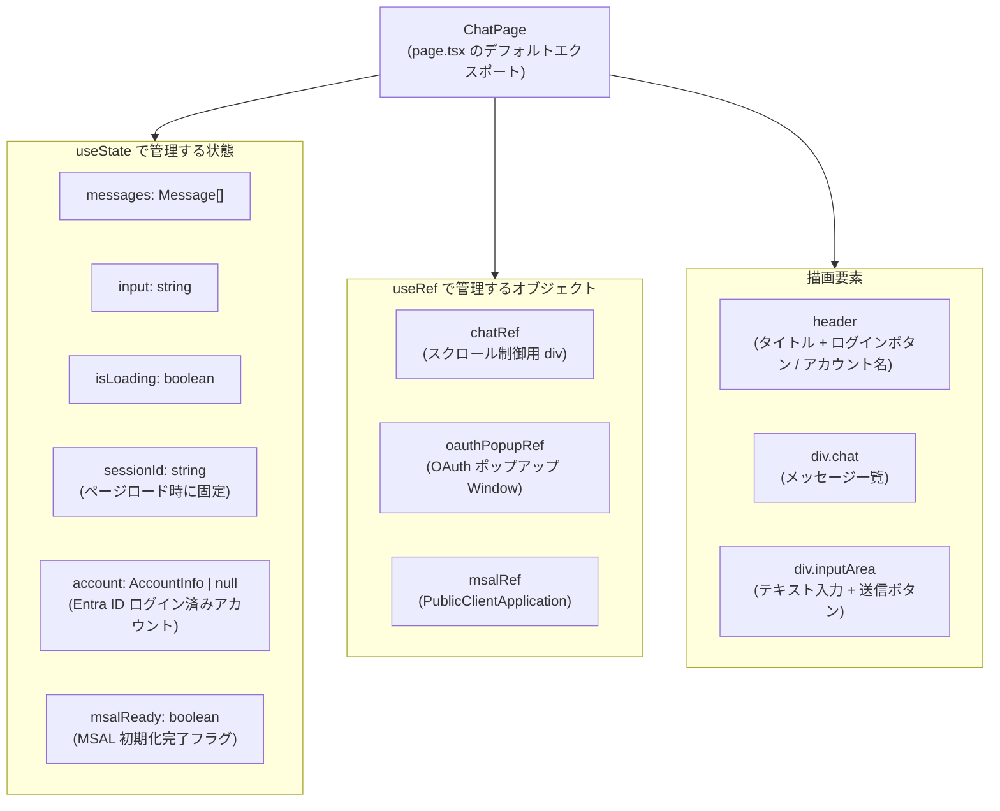
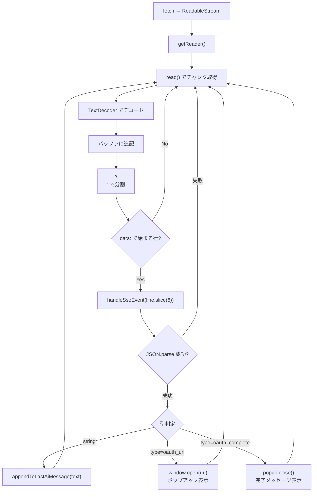
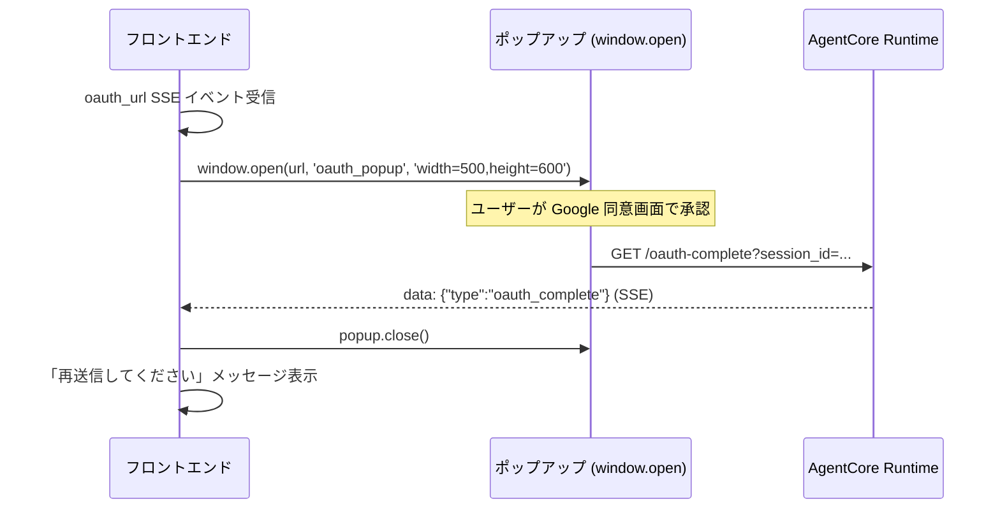
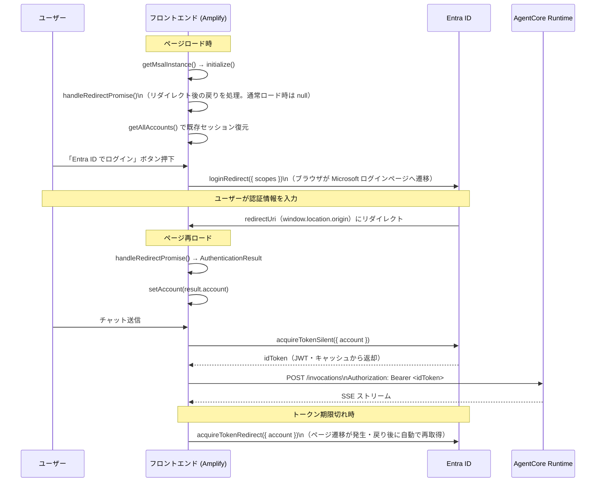

# フロントエンド詳細設計

**最終更新**: 2026-04-29（Entra ID 認証追加）  
**対象ディレクトリ**: `frontend/src/`  
**関連ドキュメント**: [`architecture.md`](architecture.md)

---

## ファイル構成

```
frontend/src/
└── app/
    ├── page.tsx          # チャット画面（唯一のページ）
    ├── page.module.css   # チャット UI のスタイル
    ├── layout.tsx        # Next.js レイアウト（ルート）
    └── globals.css       # グローバルスタイル
```

本プロジェクトはページが 1 つだけのシンプルな Single Page Application。

---

## コンポーネント構造



---

## 型定義

```typescript
interface Message {
  role: 'user' | 'ai';
  content: string;
}
```

---

## 状態管理

| 状態 | 型 | 初期値 | 説明 |
|---|---|---|---|
| `messages` | `Message[]` | `[]` | 画面に表示するメッセージ履歴 |
| `input` | `string` | `""` | テキスト入力フィールドの現在値 |
| `isLoading` | `boolean` | `false` | SSE ストリーミング中かどうか |
| `sessionId` | `string` | `crypto.randomUUID()` | バックエンドとの会話セッション識別子 |
| `account` | `AccountInfo \| null` | `null` | Entra ID でログイン済みのアカウント情報 |
| `msalReady` | `boolean` | `false` | MSAL の `initialize()` 完了フラグ |

`sessionId` は `useState` の初期化関数で 1 度だけ生成され、ページ再読み込みまで固定される。  
これによりページ内での会話履歴がバックエンドで保持される。

---

## API 呼び出し仕様

### エンドポイント

```
POST {NEXT_PUBLIC_AGENTCORE_ENDPOINT}/invocations
```

環境変数の優先順位:
1. `NEXT_PUBLIC_AGENTCORE_ENDPOINT`
2. `http://localhost:8080`（フォールバック）

### リクエスト

```json
{
  "prompt": "ユーザーが入力したメッセージ",
  "session_id": "uuid-v4"
}
```

ヘッダー:
```
Content-Type: application/json
Authorization: Bearer <Entra ID ID トークン>
```

### レスポンス（SSE）

レスポンスは Server-Sent Events（SSE）形式。各行は `data: <JSON文字列>` の形式。

**テキストトークン（通常回答）**:
```
data: "こんにちは"
data: "！"
data: "何かお手伝いできますか？"
```

**OAuth URL イベント**:
```
data: {"type":"oauth_url","url":"https://accounts.google.com/o/oauth2/..."}
```

**OAuth 完了イベント**:
```
data: {"type":"oauth_complete"}
```

---

## SSE パース処理



**バッファリングの理由**: SSE の 1 イベントが複数の TCP チャンクに分割されて届く場合があるため、  
`\n` で区切れた行のみ処理し、途中の行はバッファに残す。

---

## OAuth ポップアップ処理



- `oauthPopupRef` で `Window` オブジェクトへの参照を保持し、完了時に `close()` を呼ぶ
- ポップアップのサイズ: 幅 500px・高さ 600px（Google 同意画面の標準サイズ）

---

## 画面レイアウト

```
┌─────────────────────────────────┐
│        Mini Chat App            │  ← header
├─────────────────────────────────┤
│                                 │
│  [user]  こんにちは              │
│                                 │
│  [ai]    こんにちは！            │  ← div.chat（スクロール可能）
│          何かお手伝いできますか？ │
│                      ▊          │  ← .streaming クラスで点滅
│                                 │
├─────────────────────────────────┤
│  [テキスト入力フィールド] [送信]  │  ← div.inputArea
└─────────────────────────────────┘
```

- `useEffect` でメッセージ更新のたびに `chatRef.current.scrollTop = scrollHeight` を実行してスクロール
- `isLoading` 中は入力フィールドと送信ボタンを `disabled` にする
- ストリーミング中の最後の AI バブルには `.streaming` クラスを付与（CSS でアニメーション）

---

## Entra ID 認証フロー

リダイレクト方式（`loginRedirect`）を採用。ポップアップではなくブラウザごとMicrosoftのログインページに遷移する。  
Amplify にデプロイ済みのためリダイレクト URI が固定でき、リダイレクト方式が使えるようになった。



- MSAL インスタンスは `useRef` + モジュールスコープのシングルトンで管理（StrictMode の二重実行に対応）
- `acquireTokenSilent` 失敗時（`InteractionRequiredAuthError`）は `acquireTokenRedirect` にフォールバック
- トークンは `sessionStorage` にキャッシュされ、リダイレクト往復後も維持される

---

## 環境変数

| 変数名 | 用途 | `.env.local` | `.env.production` |
|---|---|---|---|
| `NEXT_PUBLIC_AGENTCORE_ENDPOINT` | Runtime エンドポイント URL | クラウド Runtime URL | クラウド Runtime URL |
| `NEXT_PUBLIC_ENTRA_CLIENT_ID` | Entra ID アプリのクライアント ID | `4f499ada-...` | `4f499ada-...` |
| `NEXT_PUBLIC_ENTRA_TENANT_ID` | Entra ID テナント ID | `32b23daa-...` | `32b23daa-...` |

---

## 変更履歴

| 日付 | 内容 |
|---|---|
| 2026-04-29 | 初版作成 |
| 2026-04-29 | Entra ID（MSAL）認証追加。Cognito 変数を Entra ID 変数に置き換え |
| 2026-04-29 | 認証方式をポップアップ（loginPopup）からリダイレクト（loginRedirect）に変更。Amplify デプロイによりリダイレクト URI が固定化されたため |
