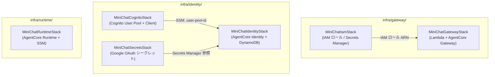
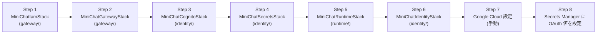
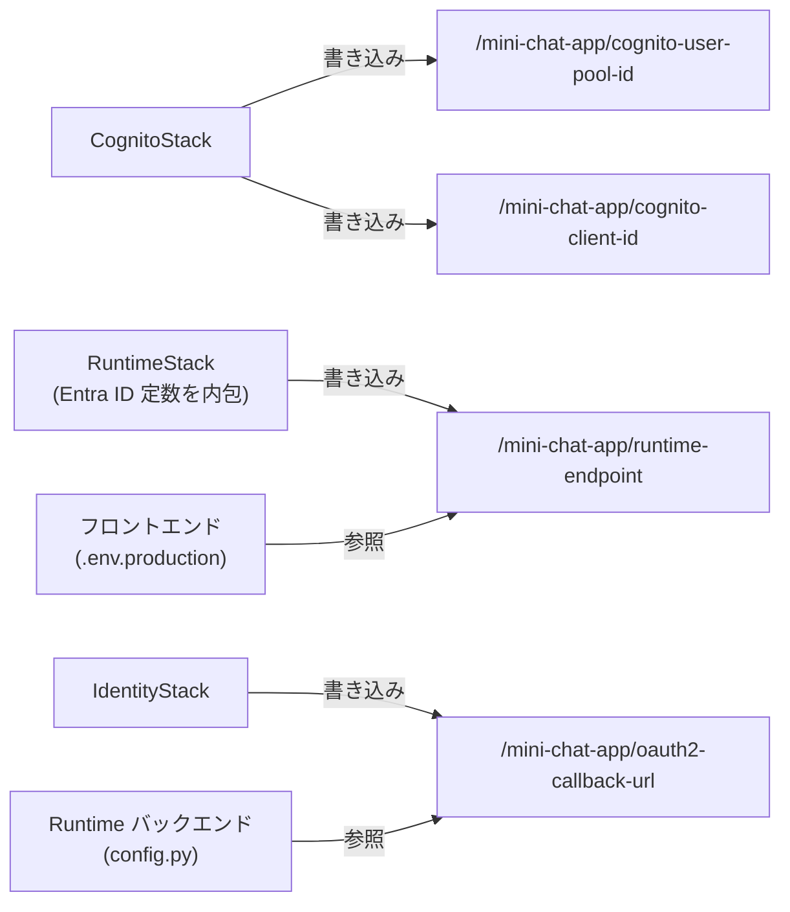

# インフラ詳細設計

**最終更新**: 2026-04-29  
**対象ディレクトリ**: `infra/`  
**関連ドキュメント**: [`architecture.md`](architecture.md)

---

## CDK プロジェクト構成

`infra/` 配下に 3 つの独立した CDK プロジェクトがある。  
`node_modules/` は `infra/` 直下で共有する。

```
infra/
├── node_modules/        # 共有 node_modules（npm install は infra/ で実行）
├── gateway/             # Tavily Lambda + AgentCore Gateway
│   ├── bin/gateway.ts
│   └── lib/
│       ├── iam-stack.ts
│       └── gateway-stack.ts
├── runtime/             # AgentCore Runtime デプロイ
│   ├── bin/runtime.ts
│   └── lib/
│       └── runtime-stack.ts
└── identity/            # Cognito + AgentCore Identity + DynamoDB
    ├── bin/identity.ts
    └── lib/
        ├── cognito-stack.ts
        ├── secrets-stack.ts
        └── identity-stack.ts
```

---

## スタック一覧



---

## デプロイ順序



> Step 7 のみ Google Cloud Console での手動操作が必要（AWS 外部サービスのため）。

---

## 各スタックのリソース詳細

### MiniChatIamStack（`infra/gateway/lib/iam-stack.ts`）

| リソース | 論理 ID | 内容 |
|---|---|---|
| Secrets Manager | `TavilySecret` | `mini-chat-app/tavily-api-key`。初期値はプレースホルダー |
| IAM Role | `LambdaRole` | Lambda 実行ロール。CloudWatch Logs + SecretsManager 権限 |
| IAM Role | `GatewayRole` | AgentCore Gateway 実行ロール。`mcp-*` Lambda 呼び出し権限 |

**出力**:
- `TavilySecretArn`
- `LambdaRoleArn`
- `GatewayRoleArn`

---

### MiniChatGatewayStack（`infra/gateway/lib/gateway-stack.ts`）

| リソース | 内容 |
|---|---|
| Lambda 関数 | `mcp-tavily-search`。Python 3.13 / ARM64 |
| AgentCore Gateway | IAM 認証。Tavily MCP ターゲット 2 つ |
| Gateway Target | `tavily-search___tavily_search`（検索） |
| Gateway Target | `tavily-search___tavily_extract`（URL 取得） |

**出力**:
- `GatewayUrl`（GATEWAY_ENDPOINT として使用）

---

### MiniChatCognitoStack（`infra/identity/lib/cognito-stack.ts`）

| リソース | 内容 |
|---|---|
| Cognito User Pool | メール / パスワード認証。JWT 発行元 |
| User Pool Client | PKCE 対応。フロントエンド用（シークレットなし） |
| テストユーザー | CDK Custom Resource で初期ユーザーを作成 |

**SSM 出力**:
- `/mini-chat-app/cognito-user-pool-id`
- `/mini-chat-app/cognito-client-id`

---

### MiniChatSecretsStack（`infra/identity/lib/secrets-stack.ts`）

| リソース | 内容 |
|---|---|
| Secrets Manager | `mini-chat-app/google-oauth`。初期値は `{"client_id":"REPLACE_ME","client_secret":"REPLACE_ME"}` |

> デプロイ後、Google Cloud Console で取得した実際の値を `aws secretsmanager put-secret-value` で設定する。

---

### MiniChatRuntimeStack（`infra/runtime/lib/runtime-stack.ts`）

| リソース | 内容 |
|---|---|
| AgentCore Runtime | `miniChatApp`。CodeZip ビルド / PUBLIC / Python 3.14 |
| JWT 認証 | `CUSTOM_JWT`（Entra ID の OIDC Discovery URL を使用） |
| OAuth Credential | `gmail`（GoogleOauth2、`gmail.readonly` スコープ） |
| SSM Parameter | `/mini-chat-app/runtime-endpoint`（Runtime の HTTPS URL） |

**Entra ID 設定**（スタック内に定数として保持）:
- `ENTRA_TENANT_ID`: `32b23daa-137d-4054-b9b3-674e256f7a7e`
- `ENTRA_CLIENT_ID`: `4f499ada-09c5-4a58-9c27-356250c69333`
- Discovery URL: `https://login.microsoftonline.com/<tenantId>/v2.0/.well-known/openid-configuration`

**出力**:
- `RuntimeId`
- `RuntimeArn`
- `RuntimeEndpointUrl`（SSM にも保存）

---

### MiniChatIdentityStack（`infra/identity/lib/identity-stack.ts`）

| リソース | 内容 |
|---|---|
| AgentCore Identity | `GoogleOauth2` タイプ。Secrets Manager の `google-oauth` を参照 |
| DynamoDB | Token Vault。PK: `user_id` / SK: `provider` |
| SSM Parameter | `/mini-chat-app/oauth2-callback-url`（Identity のコールバック URL） |

> `RemovalPolicy.RETAIN` を設定。削除すると callback UUID が変わり、Google Cloud の登録が無効になるため。

---

## クロススタック依存（SSM Parameter Store）



---

## 各環境のデプロイコマンド

```bash
# gateway スタック
cd infra/gateway
npx cdk deploy MiniChatIamStack
npx cdk deploy MiniChatGatewayStack

# identity スタック（前半）
cd infra/identity
npx cdk deploy MiniChatCognitoStack
npx cdk deploy MiniChatSecretsStack

# runtime スタック
cd infra/runtime
npx cdk deploy MiniChatRuntimeStack

# identity スタック（後半）
cd infra/identity
npx cdk deploy MiniChatIdentityStack
```

---

## 変更履歴

| 日付 | 内容 |
|---|---|
| 2026-04-29 | 初版作成 |
| 2026-04-29 | RuntimeStack の JWT 認証を Cognito から Entra ID に変更。SSM 依存を削除 |
