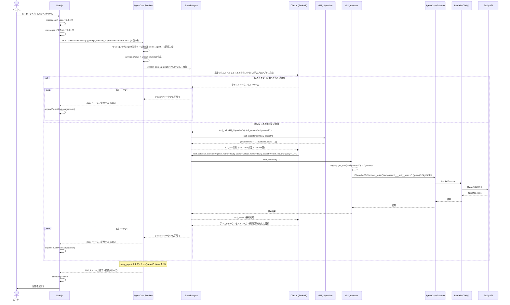

# シーケンス図 — チャットフロー（通常会話）

**最終更新**: 2026-04-29  
**対象ユースケース**: UC-1（テキストチャット）・UC-2（Web 検索 / Tavily）

---

## 概要

ユーザーがメッセージを送信してから回答が表示されるまでの流れ。  
スキルが不要な場合と、Tavily スキル（Gateway 経由）が必要な場合の 2 パターンを示す。

---

## シーケンス図

---

## ポイント解説

### セッション管理

- `session_id` はフロントエンドが `crypto.randomUUID()` で生成し、ページ存続中は固定
- Runtime はセッション対応の Agent をインメモリ dict で管理する
- 同じ `session_id` でリクエストするたびに同一 Agent が使われ、会話履歴が維持される

### SSE バッファリング

- フロントエンドは TCP チャンクを `buffer` に積み上げ、`\n` で区切れた行のみ処理する
- これにより 1 つの SSE イベントが複数チャンクに分割されても正しく処理できる

### L1 → L2 → L3 の段階的開示

- L1: システムプロンプトに `get_catalog()` の結果が埋め込まれており、LLM は常に全スキルを把握している
- L2: 必要なスキルを `skill_dispatcher` で呼び出し、使い方（SKILL.md 本文）を取得
- L3: `skill_executor` で実際のツールを実行する

---

## 変更履歴

| 日付 | 内容 |
|---|---|
| 2026-04-29 | 初版作成 |
