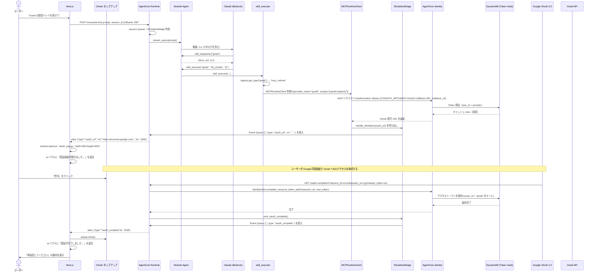
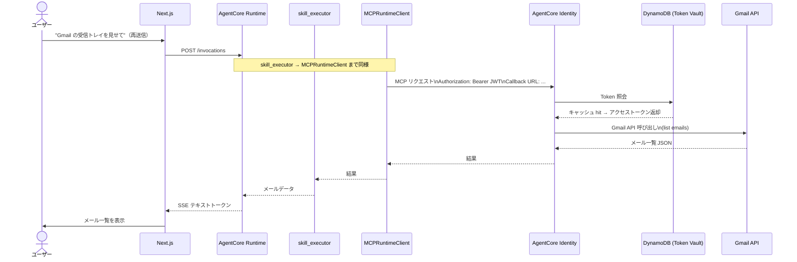

# シーケンス図 — Gmail OAuth フロー（3LO OAuth）

**最終更新**: 2026-04-29  
**対象ユースケース**: UC-5（Gmail 読み取り）

---

## 概要

Gmail スキルを初めて使う際の OAuth 認可フロー（3-Legged OAuth）。  
初回は Google の同意画面が表示され、ユーザーが承認する必要がある。  
2 回目以降は AgentCore Identity の Token Vault（DynamoDB）にキャッシュされたトークンが使われる。

---

## 初回認証フロー

---

## 2 回目以降（キャッシュ hit）

---

## ポイント解説

### ElicitationBridge の役割

`ElicitationBridge` は OAuth フロー中に処理を「中断」して SSE に OAuth URL を流し込むためのブリッジ。  
`asyncio.Queue` を介して `invoke` ジェネレータと通信するため、Agent の実行を止めずにイベントを注入できる。

### in_memory モード（ローカル開発）

`ELICITATION_MODE=in_memory` の場合は AgentCore Identity を呼び出さず、即座に完了扱いとなる。  
実際の Gmail OAuth フローは AWS デプロイ後にのみ動作する。

### RemovalPolicy.RETAIN（MiniChatIdentityStack）

AgentCore Identity リソースを削除すると callback UUID が変わり、  
Google Cloud Console に登録したリダイレクト URI が無効になる。  
このため `RemovalPolicy.RETAIN` を設定して削除を禁止している。

---

## 変更履歴

| 日付 | 内容 |
|---|---|
| 2026-04-29 | 初版作成 |
