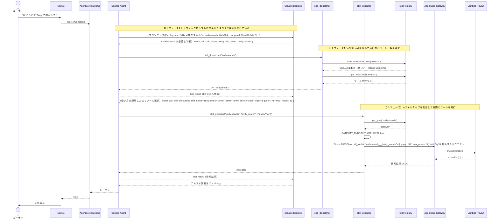
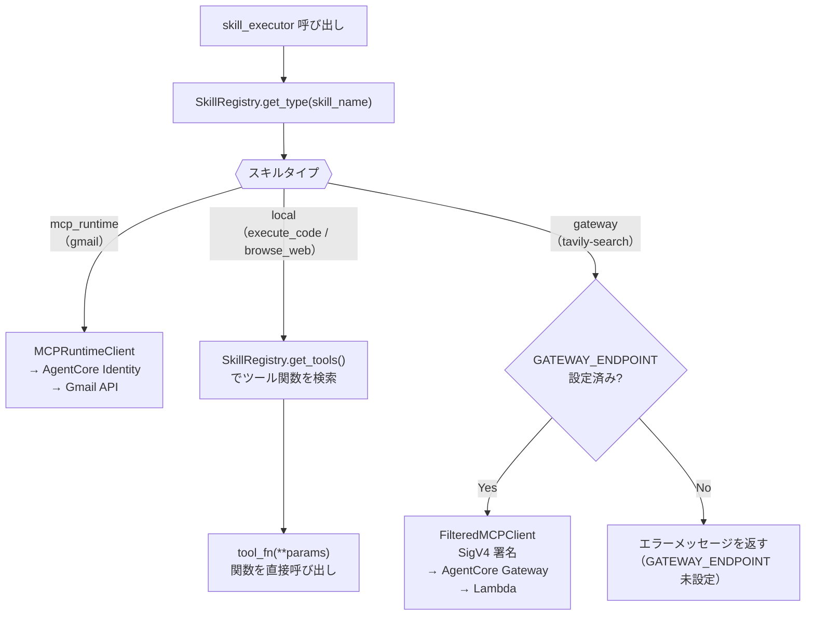

# シーケンス図 — スキルディスパッチフロー（L1 → L2 → L3）

**最終更新**: 2026-04-29  
**対象コンポーネント**: `skill/skill_registry.py` / `skill/skill_tools.py`

---

## 概要

Strands Agent がスキルを「発見 → 理解 → 実行」する 3 段階の流れ（段階的開示）。  
スキルをすべてシステムプロンプトに含めるとトークンコストが増大するため、  
必要なスキルだけを段階的にロードすることでプロンプトサイズを最小化する。

---

## L1（カタログ）→ L2（使い方取得）→ L3（実行）の全体フロー



---

## スキルタイプ別の L3 実行経路



---

## SKILL.md のフォーマット（参考）

スキルの動作は `agentcore/skills/<スキル名>/SKILL.md` で定義する。

```markdown
---
name: tavily-search          # スキル名（L1 カタログのキー）
description: Search and extract content from the web using Tavily  # L1 で表示する 1 行説明
type: gateway                # local / gateway / mcp_runtime
---

# Tavily Search               ← ここから L2 の instructions（SKILL.md 本文）

## Available Tools
- tavily_search(query, max_results=5)
- tavily_extract(urls)

## Usage Guidelines
- Web 検索には tavily_search を使う
...
```

| frontmatter フィールド | L で使われるタイミング |
|---|---|
| `description` | L1（スキルカタログに含まれる） |
| `type` | L3（skill_executor の実行経路判定） |
| `scopes` | L3（MCPRuntimeClient の OAuth スコープ設定） |
| SKILL.md 本文 | L2（skill_dispatcher が返す instructions） |

---

## 変更履歴

| 日付 | 内容 |
|---|---|
| 2026-04-29 | 初版作成 |
